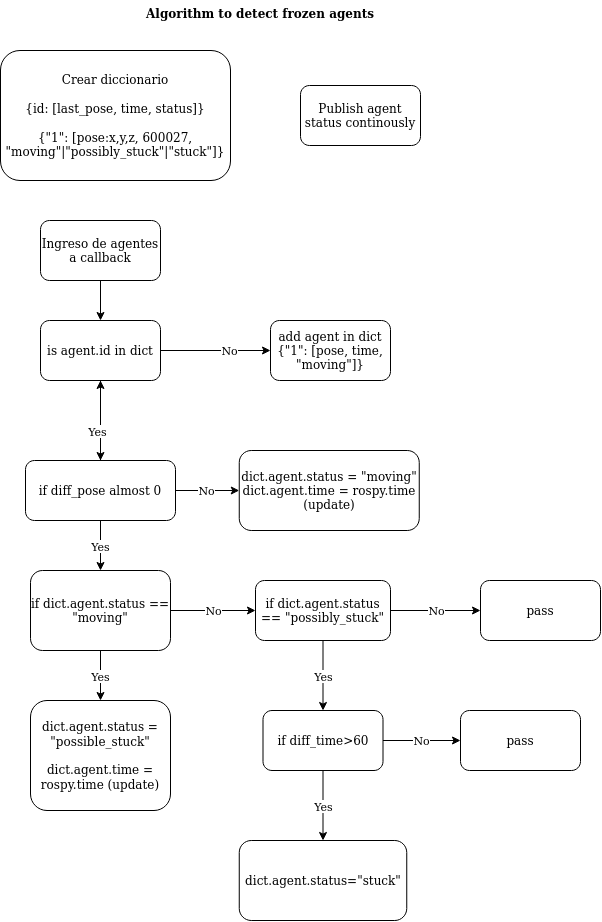

# Frozen Agent Solution

## Approach

For the solution the following stages have been considered:

1. Adding random tag to generate random order of the waypoints.
2. Code node to detect frozen agents.
3. Integrate the code to detect frozen agents and to change the random tag status.

## Algorithm to detect frozen agents

To detect frozen agents, the following algorithm is proposed:

